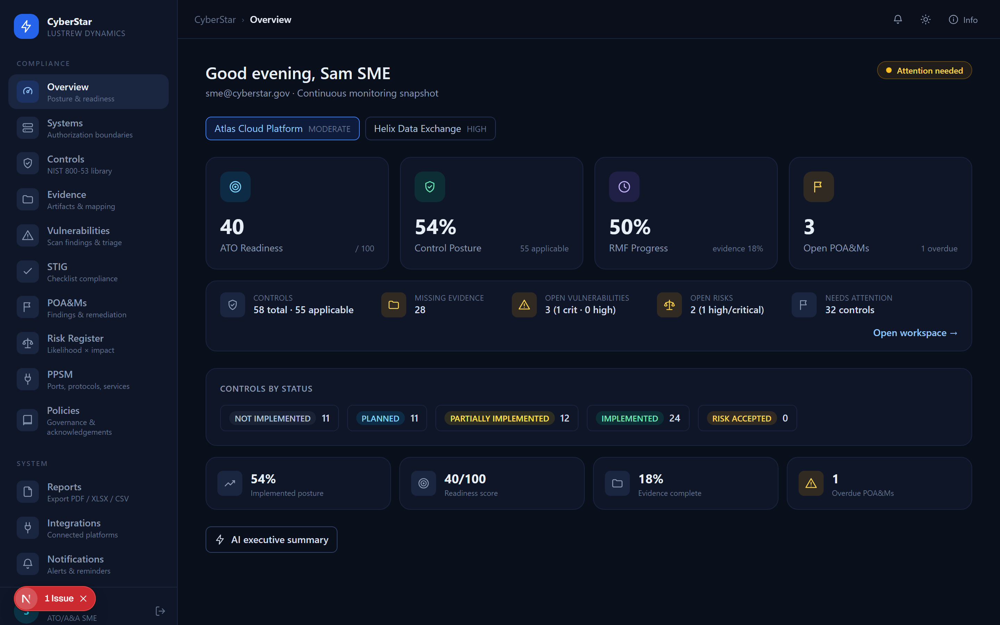
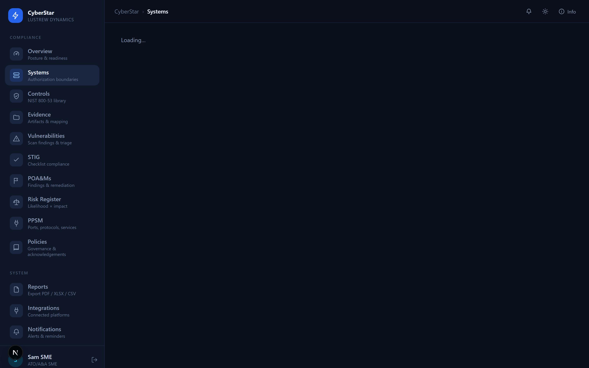
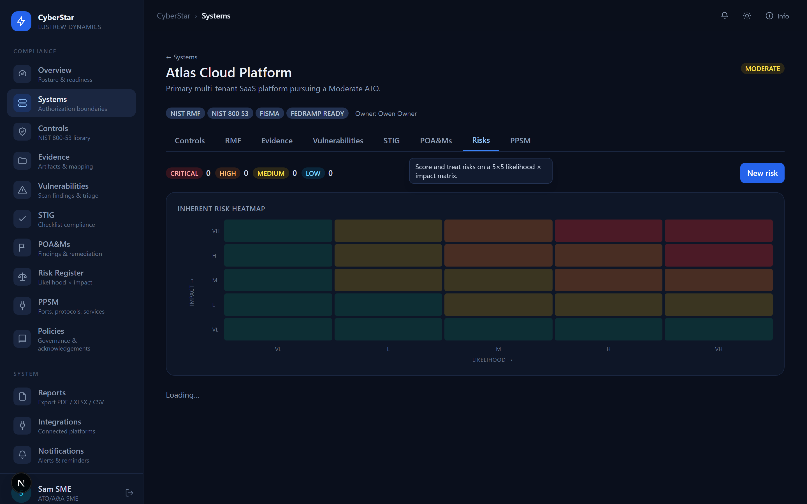
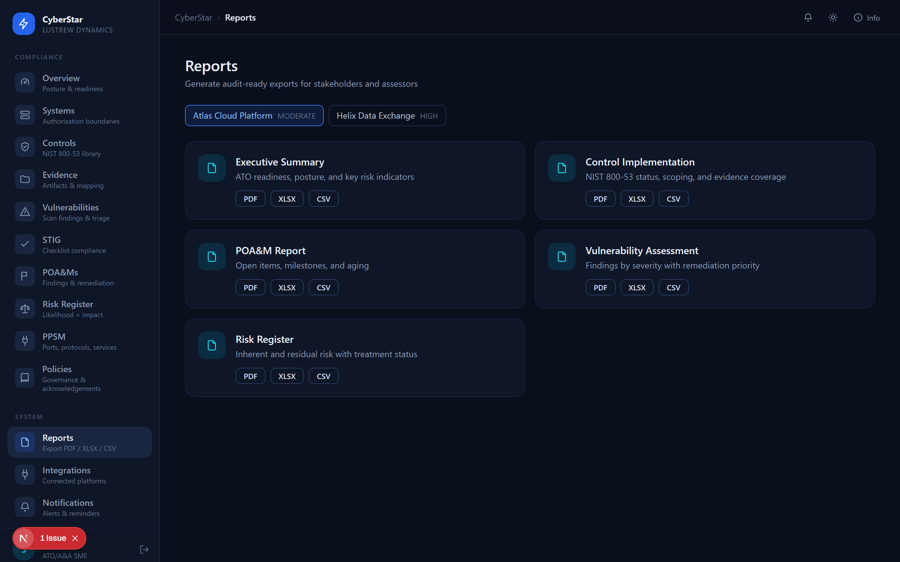
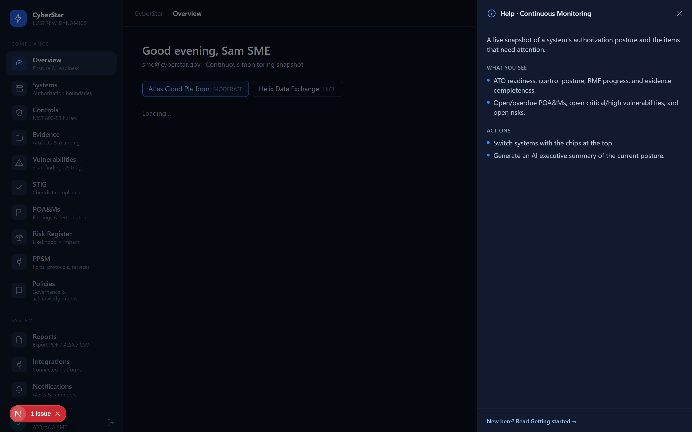
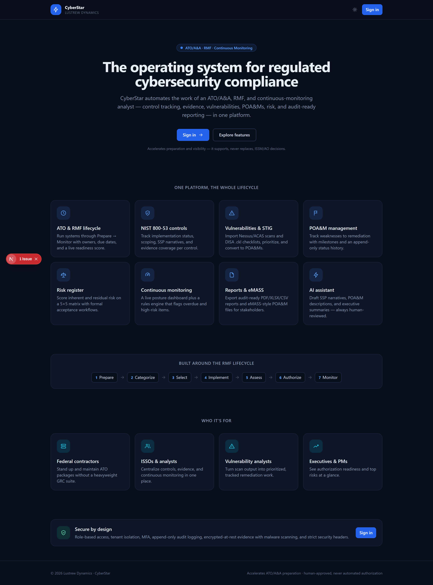
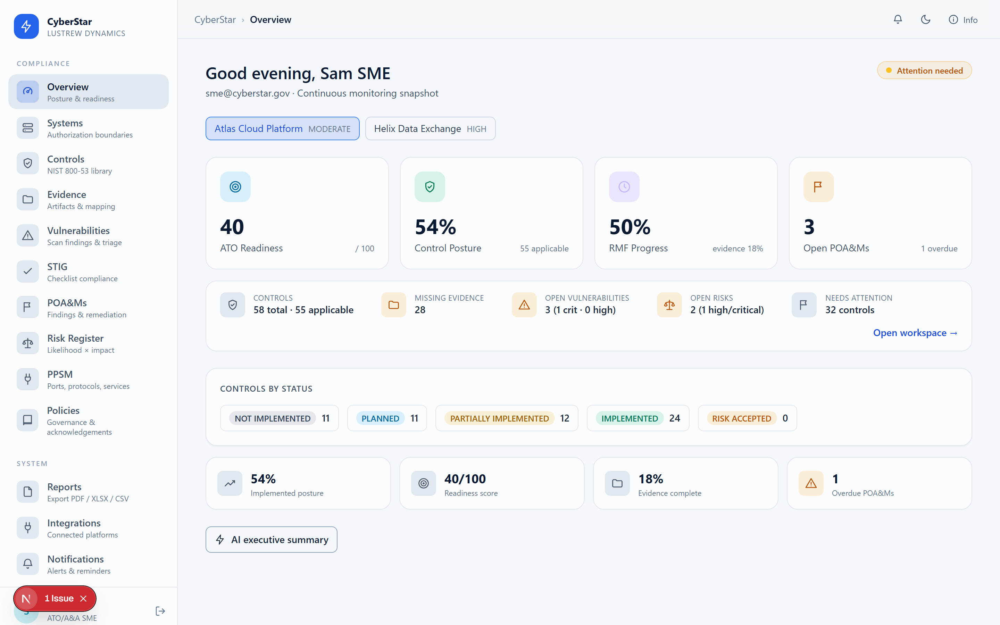

# Lustrew CyberStar

[](.github/workflows/ci.yml)
[](LICENSE)
[]()

https://github.com/tolulope-ogunlola/lustrew-cyberstar/raw/main/docs/brag.mp4

<sub>Core flow: sign in → import a Nessus/ACAS scan → convert a finding to a POA&M → dashboard updates.</sub>

Cybersecurity compliance automation for **ATO/A&A, RMF, NIST SP 800-53 control management,
evidence, POA&M, vulnerability/STIG, risk, continuous monitoring, and audit-ready reporting** —
with an AI assistant that drafts SSP narratives, POA&M descriptions, and executive summaries
(draft-only, human-approved).

> **Status: beta.** Feature-complete and security-hardened (RBAC + tenant isolation, encrypted
> secrets, nonce CSP, MFA, audit log), but review **[SECURITY.md](SECURITY.md)** and
> **[DEPLOYMENT.md](DEPLOYMENT.md)** before any production/internet-facing use, and never run the
> demo seed (default credentials) in such an environment.

> Contributing? See **[CONTRIBUTING.md](CONTRIBUTING.md)**. Architecture overview:
> **[docs/ARCHITECTURE.md](docs/ARCHITECTURE.md)**.

## Screenshots

| Continuous-monitoring dashboard | System workspace — controls |
| --- | --- |
|  |  |

| Risk register — 5×5 heatmap | Reports (PDF / XLSX / CSV) |
| --- | --- |
|  |  |

| Contextual help panel | Public landing page |
| --- | --- |
|  |  |

**Light mode** is fully supported (system-aware toggle): 

> Screenshots are generated from the running app with `npm run dev` + `npm run screenshots`
> (Playwright). Regenerate them after UI changes.

## Stack

- **Next.js 15** (App Router, TypeScript) — UI + API routes in one app
- **Prisma + SQLite** for local dev (zero setup); swap to **PostgreSQL** for production
- **NextAuth** (credentials) with role-based access control
- **Tailwind CSS**
- **Claude API** (`@anthropic-ai/sdk`) for AI drafting, with a graceful templated fallback

## What's included

| Area | Status |
| --- | --- |
| Auth + 6 RBAC roles + role-based navigation | ✅ |
| Organization / system setup (FIPS, frameworks) | ✅ |
| NIST SP 800-53 control catalog (representative subset, 17 families) | ✅ |
| Per-system control implementation tracking (status, scoping, SSP narrative) | ✅ |
| RMF lifecycle tracker (7 steps) | ✅ |
| Evidence vault with many-to-many control mapping | ✅ |
| POA&M manager (milestones + append-only status history) | ✅ |
| Vulnerability import (Nessus `.nessus` + ACAS/CSV) → dedup → CVSS prioritization → 1-click POA&M | ✅ |
| Risk register (5×5 likelihood × impact heatmap, inherent/residual scoring, acceptance workflow) | ✅ |
| Report generator — executive, controls, POA&M, vulnerability, risk → **PDF / XLSX / CSV** | ✅ |
| Continuous monitoring dashboard (ATO readiness + posture + open critical/high vulns & risks) | ✅ |
| AI assistant (control narrative / POA&M / exec summary) | ✅ |
| Append-only audit log (admin) | ✅ |
| Identity: admin user management (invite/role/deactivate), password reset + change, **MFA (TOTP)** | ✅ |
| Notifications: ConMon rules engine (overdue POA&Ms/RMF, open crit/high vulns & risks, missing evidence), center, cron | ✅ |
| STIG: DISA `.ckl` import → CAT severity + status tracking → convert to POA&M | ✅ |
| PPSM register (ports/protocols/services with approval workflow) | ✅ |
| Policy & governance library (versioning, review status, acknowledgements) | ✅ |
| Integrations: Tenable/Qualys scanner sync, ServiceNow push, eMASS export, SharePoint links (mock-verifiable) | ✅ |
| Ops: structured logging + request IDs, list pagination, upload malware scan, Redis-ready rate limiting, OSCAL import | ✅ |
| Production: one-command Postgres cutover + migrations, tenant-isolation integration tests, deployment runbook | ✅ |

Deferred to later phases (schema leaves room): secure SDLC module, the full ~1000-control 800-53
OSCAL catalog, and production observability/Postgres cutover. Integration connectors ship with a
**mock mode** for verification; live API calls require credentials.

## Setup

```bash
npm install
npm run db:push     # creates the SQLite DB (prisma/dev.db)
npm run db:seed     # loads the control catalog, demo users, and 2 sample systems
npm run dev         # http://localhost:3000
```

A working `.env` (SQLite + a generated `NEXTAUTH_SECRET`) is already included. To enable real
Claude drafting, set `ANTHROPIC_API_KEY` in `.env`; without it the AI assistant returns a
clearly-labeled templated placeholder.

## Quality checks

```bash
npm run typecheck        # tsc --noEmit
npm test                 # vitest unit tests
npm run test:integration # tenant-isolation tests on a throwaway SQLite DB
npm run build            # production build
```

CI (`.github/workflows/ci.yml`) runs all of the above on push/PR.

### Import the full NIST 800-53 catalog (OSCAL)

The seed ships a representative control subset. To load the full Rev 5 catalog:

```bash
npm run db:import-oscal -- https://github.com/usnistgov/oscal-content/raw/main/nist.gov/SP800-53/rev5/json/NIST_SP-800-53_rev5_catalog.json
# or a local file:  npm run db:import-oscal -- ./catalog.json   (defaults to a bundled sample)
```

### Notification scheduler (cron)

Notifications recompute when the center is opened and on demand ("Run checks"). For unattended
monitoring, set `CRON_SECRET` and schedule a request, e.g. hourly:

```bash
curl -X POST https://your-host/api/notifications/run -H "x-cron-secret: $CRON_SECRET"
```

This runs the rules for **all** organizations and self-resolves alerts whose condition has cleared.

## Production deployment

The schema is provider-agnostic, so the PostgreSQL cutover is one command:

```bash
npm run db:provider:postgres        # switch the datasource provider
# set DATABASE_URL, then author + apply migrations:
npm run db:migrate:dev -- --name init
npm run db:migrate                  # = prisma migrate deploy (pipeline)
```

See **[DEPLOYMENT.md](DEPLOYMENT.md)** for the full runbook: environment variables, evidence
storage (S3), mailer/AV/Redis drivers, the notifications cron, health checks + structured logging,
and the go-live security checklist. Tenant isolation is covered by `npm run test:integration`.

## Demo accounts

All use password **`Password123!`**:

| Role | Email | Sees |
| --- | --- | --- |
| Administrator | `admin@cyberstar.gov` | Everything + audit log |
| ATO/A&A SME | `sme@cyberstar.gov` | Full compliance workspace |
| ISSO / Analyst | `isso@cyberstar.gov` | Controls, evidence, RMF, POA&M |
| Vulnerability Analyst | `vuln@cyberstar.gov` | Systems + POA&M |
| System Owner | `owner@cyberstar.gov` | Systems + evidence |
| Executive / PM | `exec@cyberstar.gov` | Dashboard only |

The seed creates an organization, the control catalog, and two sample systems
(*Atlas Cloud Platform*, *Helix Data Exchange*) with mixed control statuses, evidence, RMF
progress, and POA&Ms — including an overdue one — so the dashboard is meaningful on first run.

## Walkthrough

1. Sign in as **ATO/A&A SME**.
2. **Systems → New system**: pick a FIPS category and frameworks. Control implementations and
   the 7 RMF steps are created automatically.
3. Open a system → **Controls**: set implementation status/scoping, write an SSP narrative
   (or click **✨ AI draft**).
4. **Evidence**: add an artifact and link it to controls.
5. **RMF**: advance lifecycle steps.
6. **POA&Ms**: create one (try a past due date), add milestones, change status (recorded in
   append-only history), and use **✨ AI draft** for the weakness description.
7. **Dashboard**: confirm ATO readiness, posture %, and overdue POA&M counts reflect the data;
   generate an **AI executive summary**.
8. Sign in as **Administrator** → **Audit Log** to see every action recorded.

## Guardrails

AI output is always labeled as a **draft requiring human review** and is never treated as a
final authorization decision. The platform supports — it does not replace — ISSO/ISSM judgment,
Authorizing Official decisions, or formal assessments.
